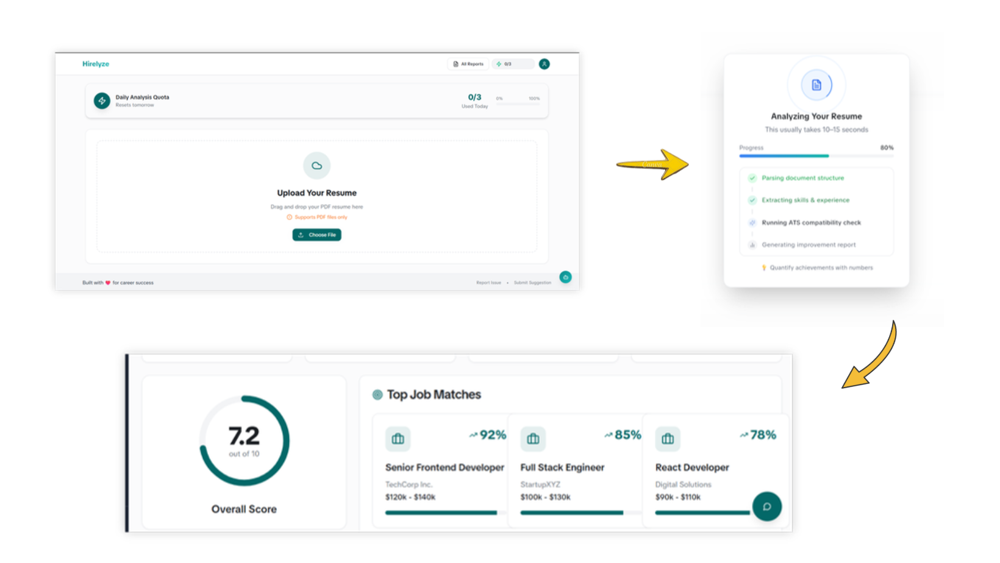

# 🚀 Hirelyze Showcase

<p align="center">
  <b>AI-Powered Career Intelligence Platform</b>
</p>

<p align="center">
  Resume analysis • ATS optimization • Career insights • AI-driven recommendations
</p>

---

## 📌 Overview

Hirelyze is an AI-powered Career Intelligence platform designed to help candidates improve their resumes, understand their strengths, identify skill gaps, and make smarter career decisions.

This repository contains the **frontend showcase** of Hirelyze, focusing on the user interface, user experience, and application flow.

The production backend, AI pipelines, prompts, and infrastructure are maintained separately.

---

## ✨ Features

- 📄 Resume upload interface
- 🤖 AI-powered resume analysis experience
- 📊 ATS score visualization
- 🎯 Career insights dashboard
- 💼 Job recommendation workflow
- 📈 Skill gap analysis UI
- 🔐 Authentication-ready architecture
- ⚡ Modern responsive interface

---

## 🛠️ Tech Stack

### Frontend

- React.js
- TypeScript
- Tailwind CSS
- React Router
- Framer Motion
- REST API Integration

### Backend (Production system)

- Node.js
- Express.js
- Sequelize ORM
- MySQL
- JWT Authentication
- Multer (File Uploads)
- PDF Parsing
- AI Agent Architecture
- OpenRouter API
- Llama 3.3 70B
- Resume Analysis Pipelines

### Development Tools

- Git
- GitHub
- VS Code
- Postman
- Docker

---

## 🏗️ Project Architecture

```
hirelyze-showcase/
├── src/
│   ├── components/
│   ├── pages/
│   ├── layouts/
│   ├── hooks/
│   ├── services/
│   └── utils/
│
├── public/
├── package.json
└── README.md
```

---

## 🎯 Product Vision

Hirelyze aims to bridge the gap between candidates and opportunities by combining:

- Generative AI
- AI Agents
- Career Analytics
- Resume Intelligence
- Intelligent Recommendations

---

## 📸 Screenshots

 

<!--
/screenshots
-->

---

## 🚀 Getting Started

Clone the repository:

```bash
git clone https://github.com/umarrahidev/hirelyze-showcase.git
```

Navigate into project:

```bash
cd hirelyze-showcase
```

Install dependencies:

```bash
npm install
```

Run development server:

```bash
npm run dev
```
<!--
---

## 🌐 Live Demo

Add deployment URL

---
-->
## 📌 Note

This repository is a frontend showcase of Hirelyze.
Production AI workflows, backend services, database architecture, and private implementation details are not included.
